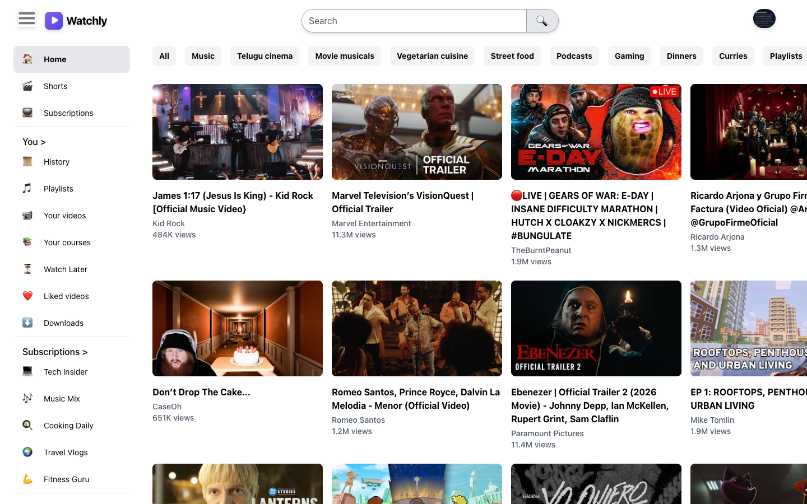
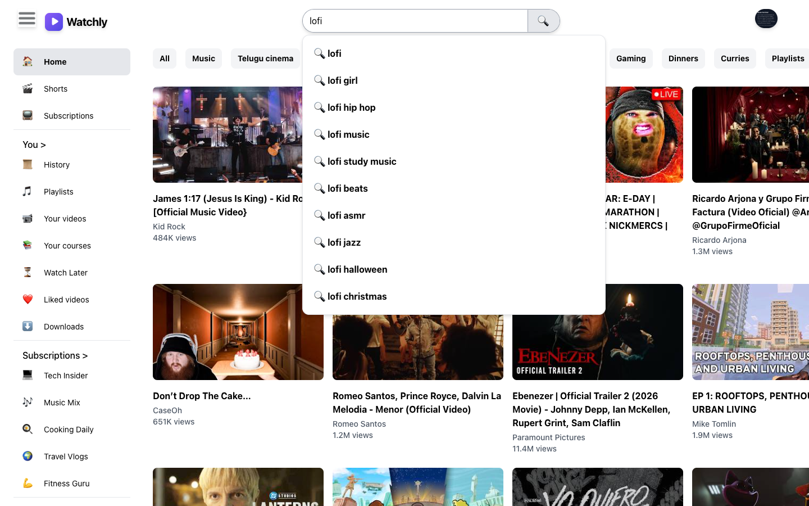
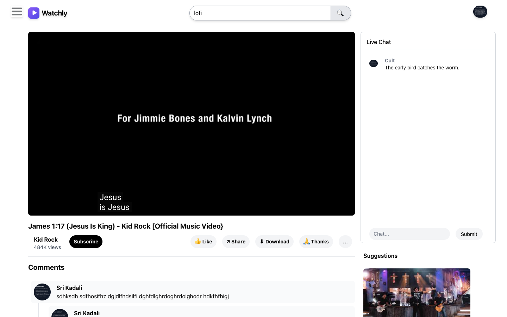

# Watchly

A video browsing web app built with React and Redux. Watchly shows the current most popular videos from the YouTube Data API, plays them on a watch page with a simulated live chat and threaded comments, and offers type-ahead search suggestions.

**Live demo:** https://watchly-eosin.vercel.app



## Features

- **Trending videos:** the 50 most popular US videos, with thumbnails, channel names, and formatted view counts (`1.9M`, `484K`)
- **Watch page:** embedded player that autoplays, video details, and suggested videos alongside
- **Search suggestions:** debounced type-ahead (200 ms) with results cached in Redux, so repeating a query never hits the network twice
- **Simulated live chat:** new messages arrive every 10 seconds, you can post your own, and only the latest messages are kept so the list stays bounded
- **Threaded comments:** replies rendered recursively to any depth
- **Collapsible sidebar:** toggled from the header and closed automatically on the watch page
- **No API keys in the browser:** all YouTube API calls go through serverless functions

| Search suggestions | Watch page |
| --- | --- |
|  |  |

## Tech stack

| Layer | Tools |
| --- | --- |
| Frontend | React 19, Redux Toolkit, React Router, Tailwind CSS |
| Serverless API | Vercel Functions (Node.js) |
| Data | YouTube Data API v3, Google search suggestions |
| Hosting | Vercel |

## Architecture

```
Browser (React + Redux)
   │
   ├── GET /api/videos        ──►  Vercel Function ──► YouTube Data API (most popular)
   │       (fields trimmed, CDN-cached for 1 hour)
   │
   ├── GET /api/suggest?q=... ──►  Vercel Function ──► Google search suggestions
   │       (CDN-cached for 1 hour)
   │
   └── youtube.com/embed/<id>      video playback (iframe)
```

**Why serverless functions?** The first version called the YouTube Data API straight from the browser, so the API key was bundled into public JavaScript where anyone could copy it. Moving the call into a Vercel Function keeps the key on the server. The function only makes the one request the app needs and asks YouTube for just the fields the UI renders, which cuts the response to about 13 KB. Responses are cached at the CDN, so most visits use no API quota at all.

Search suggestions need a server too, for a different reason: Google's suggestion endpoint doesn't send CORS headers, so browsers block direct calls to it.

**Local development without extra tooling:** `src/setupProxy.js` mounts the same `/api` handlers inside the `npm start` dev server, so the app runs locally exactly as it does on Vercel, with the key still kept out of the browser.

**State management:** Redux Toolkit slices hold the sidebar state, the search suggestion cache, and the live chat messages.

## Run locally

```bash
git clone https://github.com/sskadaliG/Sri-Tube.git watchly
cd watchly
npm install
cp .env.example .env   # then add your YouTube API key
npm start
```

You'll need a free **YouTube Data API v3** key:

1. Create a project at https://console.cloud.google.com
2. Enable **YouTube Data API v3** under APIs & Services → Library
3. Create an API key under APIs & Services → Credentials, and restrict it to the YouTube Data API v3

The key is only used server-side, so don't add a website (HTTP referrer) restriction to it, or the server's requests will be rejected.

## Deploy to Vercel

1. Import the repository at https://vercel.com/new (it detects Create React App automatically)
2. Add `YOUTUBE_API_KEY` under Project → Settings → Environment Variables
3. Deploy

`vercel.json` rewrites every non-`/api` path to `index.html`, so links like `/watch?v=...` work when opened directly.

## Project structure

```
api/
  videos.js         most popular videos (YouTube Data API proxy)
  suggest.js        search suggestions proxy
src/
  components/       Header, sidebar, video grid, watch page, chat, comments
  hooks/            useVideos data-fetching hook
  store/            Redux slices (app, search cache, chat)
  utils/            constants, menu data, view-count formatting
  setupProxy.js     serves /api locally under npm start
```

## Disclaimer

Watchly is a portfolio project and is not affiliated with YouTube or Google. Video data comes from the [YouTube Data API](https://developers.google.com/youtube/v3), and videos play through the official YouTube embedded player. Chat messages and comments are sample data.
